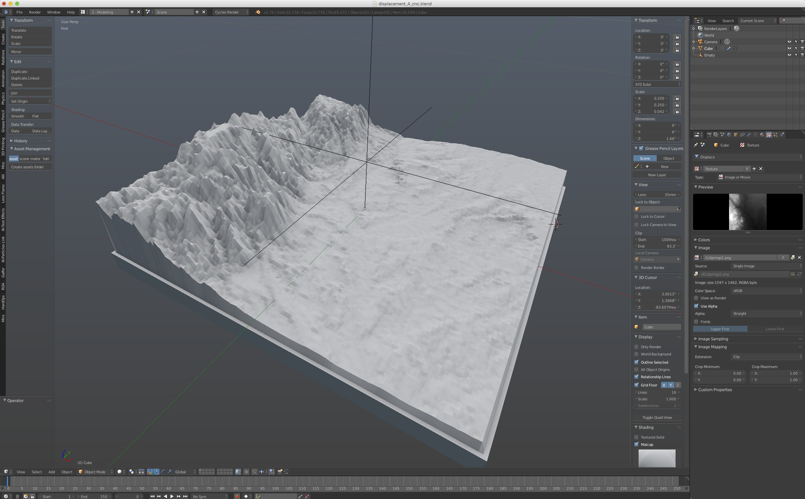

# Displacement_4_CNC
### A short guide to using Blender and displacement Maps for making surfaces for CNC Milling
An example file is available in the repository if you just want to use it and adjust the texture or sizing.

Blender Instructions:
1. Goto the scene Tab on the right panel and change the Units Preset to Inches
2. Select the cube, press n to bring up the Number panel and type in the size of your wood block minus what you plan to cnc
3. press “Tab” to enter edit mode, then “a” to clear your selection.
4. press “ctrl + Tab” to select by faces then select the top face
5. goto the Object Data tab on the right panel and add a vertex group by hitting the big plus on the right. then click on Assign to assign the top face to the new vertex group
6. goto Tools Tab on the left, select “Loop Cut and Slide” and hover over your block until to see the pink rectangle, then roll your mouse wheel until you get 30 cuts. press the left mouse button to cut, and a second time to leave the cuts where they are.
7. repeat step six for the cuts in the other direction
8. press “a” to select all, then “Shift + e” and then “1” to sharpen all of our edges
9. hit tab to get out of edit mode.
10. add a subdivision modifier in the modifier tab on the right and set the view value up to 2 - you can go higher to add more detail later, but watch your face count!
11. add the displacement modifier. set the direction to z, the Vertex Group to your vertex group then click New in the Texture box
12. Go to the Texture Tab in the right panel, and under Image, hit “Open” to find and double click on your image
13. if you want to spread one image over the whole block, goto Image Mapping in the Texture Tab and set Extension to “Clip” - you should see a small version of your depth map in the middle of your surface
14. Go back to the Modifier Tab and adjust the strength value
15. Press “Shift + a” to add an Empty object with plain axis. Use the blue arrow to pull it up out of the object for better visibility. Right click on the box to switch back to it.
16. Still in the Modifier Tab, in the Displacement Modifier, change the Texture Coordinates to Object, In the new box, click and select the Empty.
17. Select and then scale and move the Empty to adjust the size and position of your texture using the arrows to move and “s” to scale. 
18. Pay attention to the total height in the Number panel.
19. Save your file!
20. Swap textures as needed by opening a new file or adding additional textures with the same settings.

(WIP - updates coming)