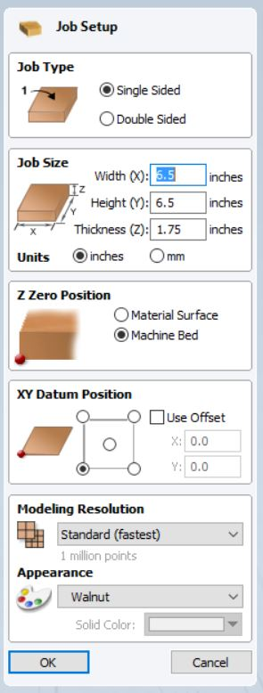
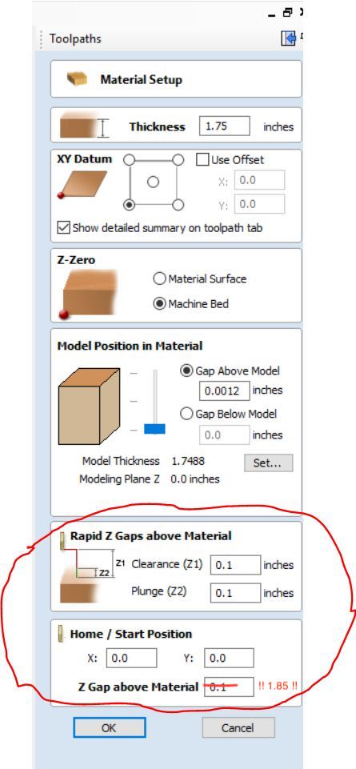
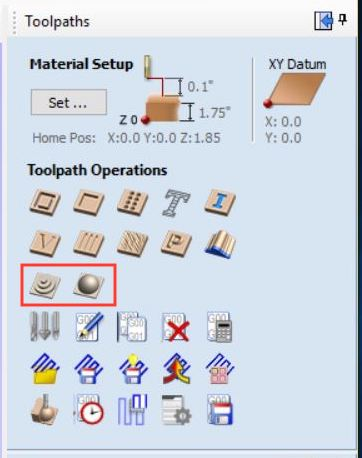
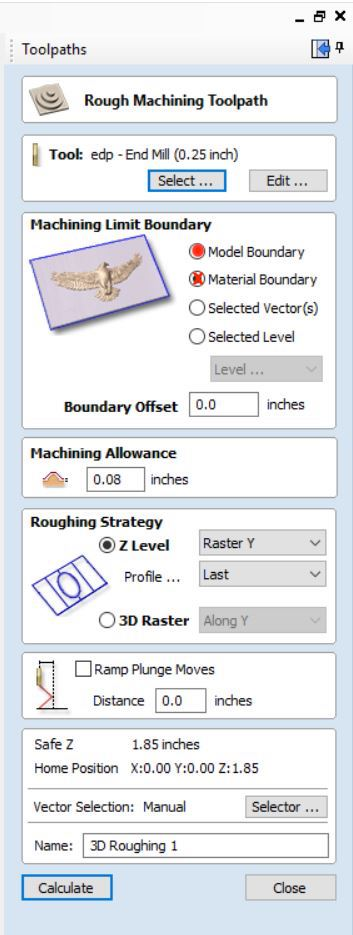
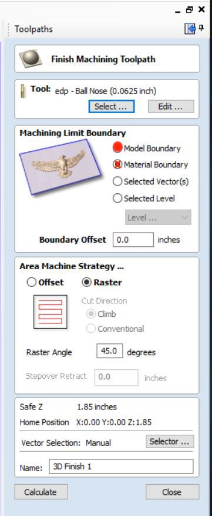
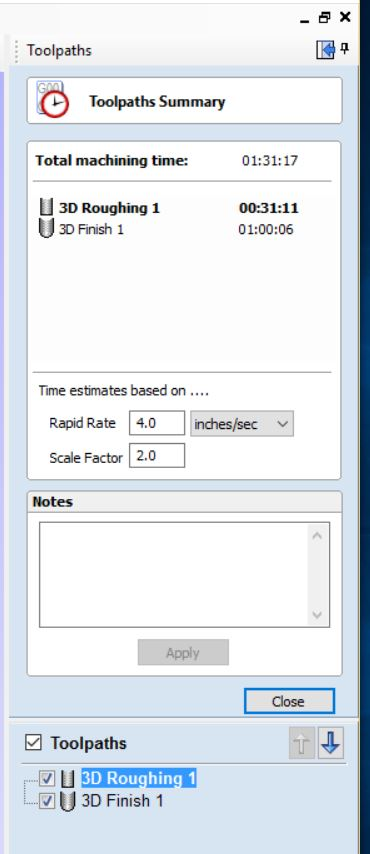
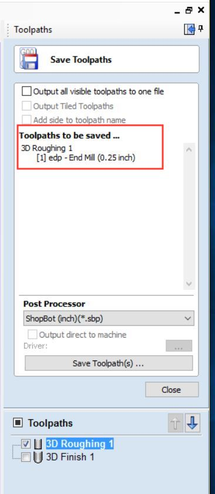
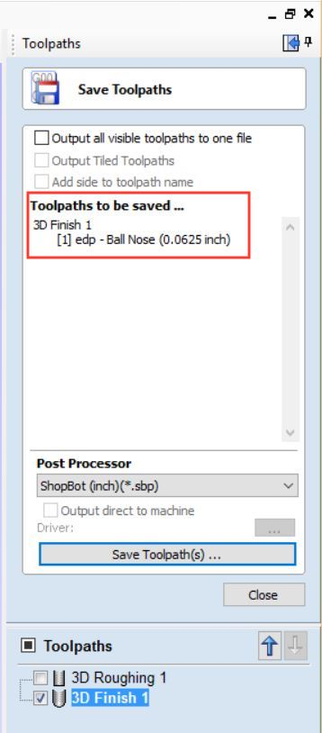
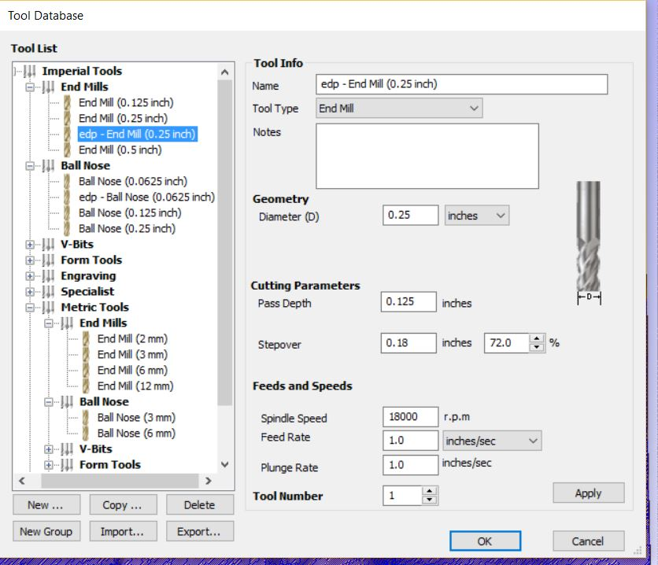
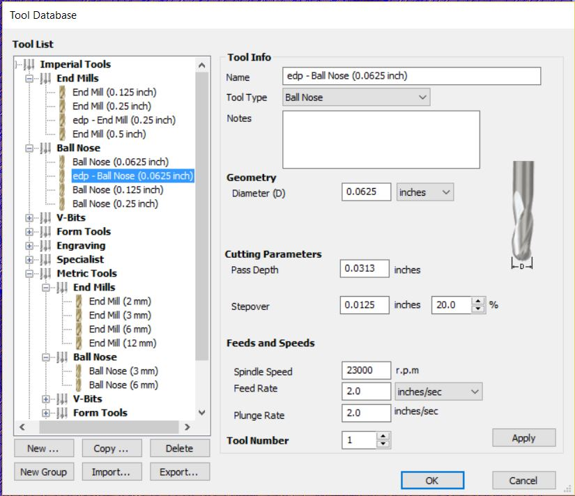

# V-Carve Instructions

These instructions assume you have done the following:
- gotten the key to turn on the machine and also flipped the orange stop switch in the up position
- used the shopbot software to move the router out of the way so you can screw the jig to the table with all 4 screws and then clamped your block of wood in place with the grain running left to right
- moved the machine so you can put in the 1/4" endmill as deep as it can go and then used the wrench to secure it
- lower the router to zero the Z axis to the base of the shopbot - so the bit just touches the wood surface. Then set z to zero in the shopbot software
- carefully move the router up and then over so the bit is lined up with the lower left corner of the material and then set the X and Y axis to zero (BUT NOT THE Z!)
- close the hood, as the machine is now ready for you to give it a toolpath file...

##1 - Setup Material 
Set where the x, y + z coordinates are
- Job size = size of material (x, y, + z measurements)
- Z-zero Position and XY Datum Position = where you set your zero positions relative to the material

##2 - Import and position 3D file 
Just like 3D printer - position 3D file in relation to material you just set up.
Note that model should be a little bit bigger than material to account for “bleed” & to not carve into side of the material.
- Set the X or Y size on the model and it should resize the height appropriately.
- If the "Depth Below Top" is more than 1.75 your model is too tall and you must scale it down on the z axis in Blender!

##2.1 - Check your Z-clearances
For our material and bits, we want to stay low to the surface. We need to confirm those settings in the Material Setup, located at the top of the Toolpaths menu:

##3 - Choose your bits & make your ToolPaths 
We will be doing 2 passes - the Roughing Pass and the Finish Pass

- 1st pass = Rough Pass (does all the rough, bigger cuts)
-- 1/4” 2 flute end mill 
-- Remove a lot of material up to 1/8th inch material

- 2nd pass = Fine Pass (detailed cuts)
-- 1/16” tapered ball nose
-- Removes very small amount of material

##4 - Preview your tool paths
You can see what your settings will do through a visual preview of the material and tool path. This is where you can test your settings before you send to ShopBot. Imperative you watch the preview to be sure your settings look successful.

You can check your time estimate as well:

##5 - Save files for each tool path 
- 1 file for the Rough Pass

- 1 file for the Fine Pass - remember you must re-zero your Z because you will change your bit between running these two passes! DO NOT re-zero x or y!

##Run the ToolPaths
1. First run the rough toolpath file - watch it and listen, you will hear if something is going wrong
2. grab the vaccum and start cleaning as you open the hood - clean all the sawdust you can
2. Move the machine to the side so you can change to the Ball Nose bit
3. Re-Zero your Z axis to the machine bed
4. Carefully move the machine back to a position over the material
5. Run the finish toolpath file - watch it and listen, you will hear if something is going wrong
6. grab the vaccum and start cleaning as you open the hood - clean all the sawdust you can
7. remove your wood, and if no one is waiting for you from our class, unscrew the jig
8. Vaccum again - leave everything CLEANER than you found it!
9. Put everything away

##Appendix 
Do not change these because all changes stick and would mess up other students!!

Your edp - End Mill setting should look like this:

Your edp - Ball Nose setting should look like this:

